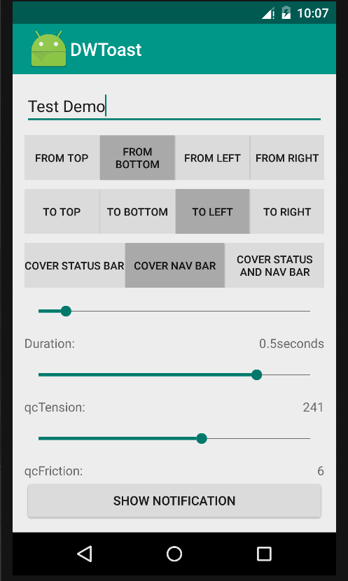
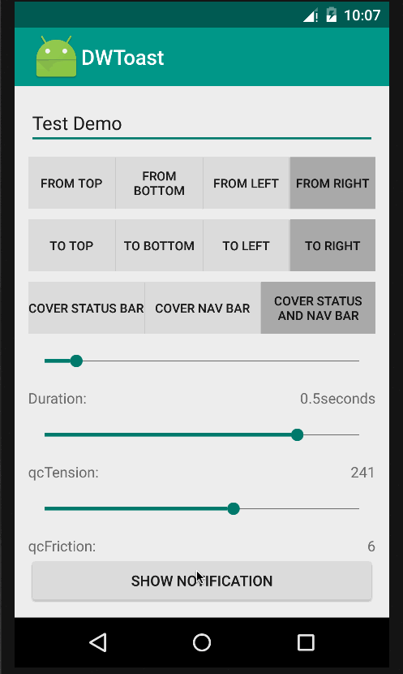

# DWToast

`DWToast` 是一款针对Android状态栏和标题栏提示工程。






#Requirements

`DWToast` 使用AS和Android-SDK 23 - Tools 23 - Gradle 2.4 ，运行在phone 和 pad

#Usage

只需要导入toastactivity包和配置styles以及AndroidMainfest.xml文件即可

#Example
```Obj-C
		Intent intent = new Intent(this,ToastActivity.class);
		//动画进入类型
        intent.putExtra("form_num",form_num);
        //动画离开类型
        intent.putExtra("to_num",to_num);
        //停留时间
        intent.putExtra("time",time);
        //遮盖状态栏，标题栏类型
        intent.putExtra("coverType",coverType);
        //弹性
        intent.putExtra("qcTension",qcTension);
        //阻力
        intent.putExtra("qcFriction",qcFriction);
        //内容描述
        intent.putExtra("description",description);
        startActivity(intent);
```
```Obj-C
		switch (coverType){
            case Constants.status:
                getWindow().setFlags(WindowManager.LayoutParams.FLAG_FULLSCREEN,  WindowManager.LayoutParams.FLAG_FULLSCREEN);
                //状态栏的高
                viewHeight = dip2px(25);
                break;
            case Constants.nar:
            	//标题栏的高
                viewHeight = dip2px(56);
                break;
            case Constants.statusAndNar:
                getWindow().setFlags(WindowManager.LayoutParams.FLAG_FULLSCREEN,  WindowManager.LayoutParams.FLAG_FULLSCREEN);
                //状态栏和标题栏的高
                viewHeight = dip2px(81);
                break;
        }
```

#Insert

`DWToast`有引用`rebound` 和 `systembartin` 库 具体引用位置在build.gradle内容中
